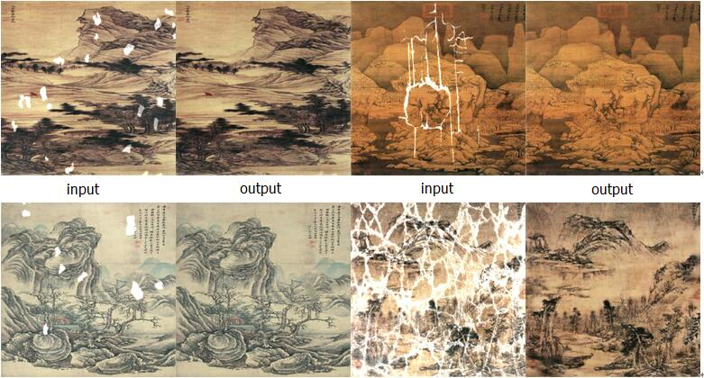

# II-CGAN-tensorflow

Tensorflow implementation of II-CGAN.  Learns a mapping from input images to output images, like these examples from the original paper:



## Setup

### Prerequisites
- Tensorflow 1.0.0

### Recommended
- Linux with Tensorflow GPU edition + cuDNN

### Getting Started

```sh
# clone this repo
git clone https://github.com/ailib/II-CGAN.git
cd II-CGAN
# download the D_img dataset
The way will be publicly available later
# train the model (this may take 100 hours depending on GPU K80)
python ii_cgan.py \
  --mode train \
  --output_dir graph \
  --max_epochs 100 \
  --input_dir D_img/train \
  --which_direction BtoA
# test the model
python ii_cgan.py \
  --mode test \
  --output_dir test \
  --input_dir D_img/val \
  --checkpoint graph

